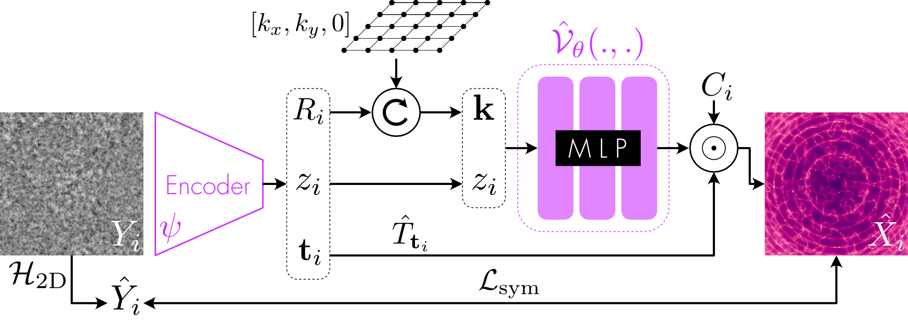
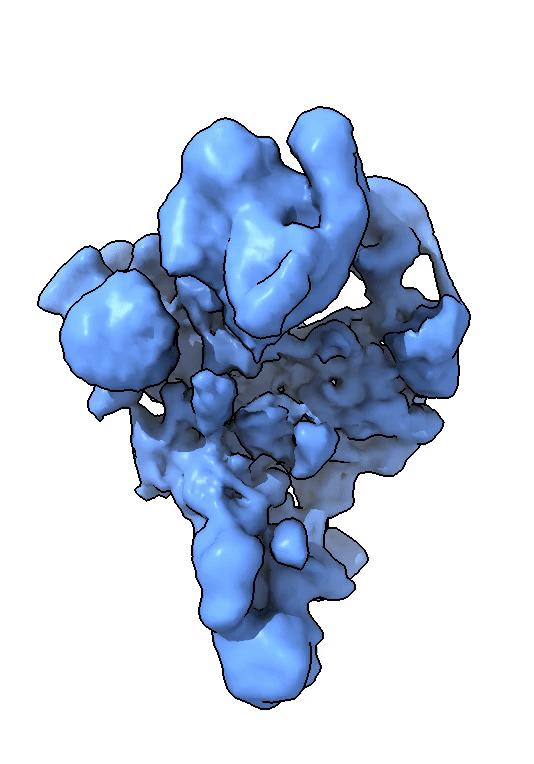

# :snowflake::fire: Amortized Inference for Heterogeneous Reconstruction in Cryo-EM (CryoFIRE)

CryoFIRE (Fast heterogeneous ab Initio Reconstruction for cryo-EM), performs ab initio heterogeneous reconstruction with unknown poses in an amortized framework.
Poses and conformation are jointly estimated by an encoder while a physics-based decoder aggregates the images into an implicit neural representation of the conformational space.



## Manuscript:

[Amortized Inference for Heterogeneous Reconstruction in Cryo-EM](https://arxiv.org/abs/2210.07387) \
Axel Levy, Gordon Wetzstein, Julien Martel, Frédéric Poitevin, Ellen D. Zhong.

## Requirements

We recommend using [Anaconda](https://www.anaconda.com/) to set up the environment. Run the following commands:

```
conda env create -f environment.yml
conda activate cryofire
```

## Quickstart

### 1. Preprocessing image stack

Example of script for downloading and preprocessing for "EMPIAR-10028: Pf80S Ribosome"
[Wong, W. et al. Cryo-EM structure of the Plasmodium falciparum 80S ribosome bound to the anti-protozoan drug emetine. Elife 3, e01963 (2014).](https://elifesciences.org/articles/03080):

```
# Download EMPIAR-10028 particles (~51GB)
ascp -QT -l 200M -P33001 -i ~/.aspera/connect/etc/asperaweb_id_dsa.openssh emp_ext3@hx-fasp-1.ebi.ac.uk:/10028 .

# Downsample dataset
cryodrgn downsample shiny_2sets.star --datadir 10028/data -D 128 -o particles.128.mrcs -D 50000

# Extract pose and ctf information from cryoSPARC refinement
cryodrgn parse_ctf_csparc cryosparc_P11_J4_003_particles.cs -o ctf.pkl
cryodrgn parse_pose_csparc cryosparc_P11_J4_003_particles.cs -D 360 -o poses.pkl
```

More datasets available at https://github.com/zhonge/cryodrgn_empiar.

### 2. Launching an experiment

The parameters of your experiment must be saved in a `.json` file in the `configs` directory.
Run your experiment with

```
python src/commands/train.py name_of_your_config
```

We provide an example of config file and script for reconstructing a pre-catalytic spliceosome from the EMPIAR-10028 dataset. In the `scripts` directory, run

```
bash run_empiar10028.sh
```

Experiments can also be launched from a jupyter notebook. See `notebooks/template.ipynb` for an example.

### 3. Monitoring your experiment

Your experiment can be monitored using `tensorboard`.
The path to the summaries must be specified in the config file.
To monitor your experiment, run

```
tensorboard --logdir path_to_log_directory --port XXXX --bind_all
```

### 4. Landscape analysis

You can generate volumes from a CryoFIRE model and a set of conformation variables using `src/commands/generate_volumes.py`.
See `notebooks/template.ipynb` for a template.




## Parameters

```
particles: Particle stack file (.mrcs, .star, .txt)
outdir: Output directory to save model
norm: Data normalization as shift, 1/scale (default: mean, std of dataset)
load: Initialize training from a checkpoint
log-interval: Logging interval in number of images
log-heavy-interval: Heavy logging interval (poses, images, testing) and checkpoint saving in epochs
seed: Random seed
ctf: CTF parameters (.pkl)
ind: Filter indices (.pkl)
pose: GT poses (.pkl)
colors: GT colors (.pkl)
relion31: Flag if relion3.1 star format
lazy: Activates lazy data loading
verbose-time: Print runtimes
num-workers: Number of CPUs for data loading

test-particles: Particle stack file for testing (.mrcs)
test-ctf: Test CTF parameters (.pkl)
test-pose: Test GT poses (.pkl)
test-colors: Test GT colors (.pkl)

num-epochs: Number of training epochs
batch-size: Minibatch size
wd: Weight decay in Adam optimizer
lr: Learning rate in Adam optimizer
beta-conf: Choice of beta schedule or a constant for KLD weight for conf VAE
no-trans: Inference over image rotation only
sym-loss: Activate symmetric loss
sym-loss-factor: Symmetric loss factor ([2])
loss-scale: Total loss multiplicative factor
pose-only-phase: Number of images for the pose-only phase
output-mask: Type of output mask (['circ', 'frequency_marching'])
add-one-frequency-every: Number of images between the addition of one frequency to the output mask

use-gt-poses: Use ground truth poses
depth-cnn: Number layers in the shared cnn
channels-cnn: Number of channels in the first layer of the shared cnn
kernel-size-cnn: Kernel size in the shared cnn
variational-het: Sets the conf VAE in variational mode
z-dim: Dimension of latent variable
input-mask: Type of input mask (['none'])
std-z-init: Standard deviation of z during pose-only phase

hypervolume-layers: Number of hidden layers fot hypervolume
hypervolume-dim: Number of nodes in hidden layers for hypervolume
pe-type: Type of positional encoding (['gaussian'])
pe-dim: Num features in positional encoding
feat-sigma: Scale for random Gaussian features
hypervolume-domain: Implicit representation domain (['hartley'])
```

## Reference

```
@article{levy2022amortized,
  title={Amortized Inference for Heterogeneous Reconstruction in Cryo-EM},
  author={Levy, Axel and Wetzstein, Gordon and Martel, Julien and Poitevin, Frederic and Zhong, Ellen D},
  journal={arXiv preprint arXiv:2210.07387},
  year={2022}
}
```